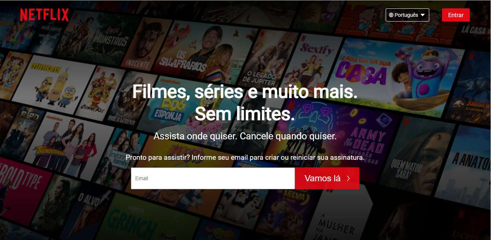

<h1 align="center">
CLONE - NETFLIX
</h1>

<h1>

</h1>

## 📝 Sobre:

O clone é da Página principal da plataforma Netflix. Decidi desenvolver o projeto para praticar as habilidades com as ferramentas utilizadas.

---

## 🚀 Tecnologias utilizadas

O projeto foi desenvolcido utilizando as seguintes tecnologias:

- React
- CSS

---

## 📦 Como baixar o projeto

```bash

    # Clonar o repositório
    $ https://github.com/mlemos07/clone-netflix.git

    # Instalar as dependências
    $ npm install

    # Iniciar o projeto
    $ npm start

```

---

## ⚠ Observações:

- O projeto continua em constante desenvolvimento para trazer a melhoria da interface e do código, visto que é possível melhorar o clone.

---

Desenvolvido por Marianna Lemos 💜.